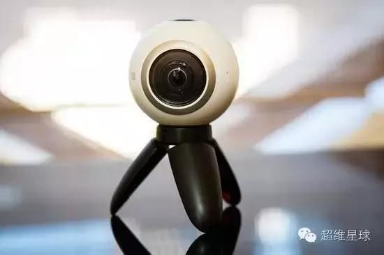
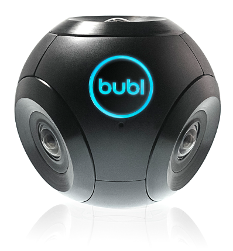

a list of contemporary panoramic Cameras

## Insta360 Nano
Epic shots are easy with the all-new bullet time effect. Watch as you move through the center of a scene while the ONE swoops around you, capturing every angle in up to 240 FPS.
The ONE shoots at a maximum of 120 FPS, while 240 FPS video is achieved algorithmically with the companion app.

## Nico360
Highest resolution, smallest size! The first 360 camera that features live streaming.

## Perfant VR Eyesir VR

## Samsung Gear 360
The Gear 360 has evolved to let you record in 4K or broadcast live, and then make it your own with the Samsung Gear 360 app. And with the Gear 360's smaller size and redesigned, easy-to-grip body, memories aren't the only thing you'll want to hold onto.

##DETU F4
4 Lenses Commercial 360° Camera

Lightweight and handy

670g lightweight portable to take along.

Ultra high quality

6K ultra-high-quality and Detu professional softwares supported.

VR live streaming

Creates VR live streaming on 4K resolution.

## Nikon keymission 360
Capture and share fully immersive 360° interactive videos and photos
Waterproof, shockproof and freezeproof with no additional housing
Record 4K Ultra HD videos, 23.9-megapixel photos, time-lapse sequences and more
SnapBridge integration for real-time wireless sharing
Compact and lightweight with over 10 mounting accessories available

## Nokia OZO

## 360fly 4K
Built to stand up to your active lifestyle, the 360fly 4K gives you the power to record, share
and experience life like never before—in fully immersive 360º video, standard First-person POV video,
VR-compatible footage and 360º stills.

## Bublcam
The world’s first 360 spherical camera. Capable of capturing the world around you in spherical photos and videos with absolutely no blind spots.

The Bublcam delivers a level of innovative content delivery poised to help advance the world of VR, something we too are so excited about. Priced competitively at $799 USD.

