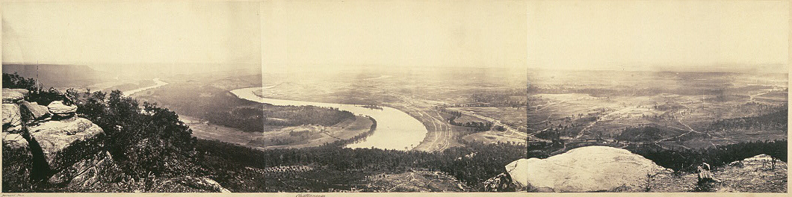

# Guiding questions
### by ciel

- *Panoramic photography* is a technique of photography, using specialized equipment or software, that captures images with horizontally elongated fields of view. It is sometimes known as wide format photography. The term has also been applied to a photograph that is cropped to a relatively wide aspect ratio, like the familiar letterbox format in wide-screen video.

- The development of panoramic cameras was a logical extension of the nineteenth-century fad for the panorama. One of the first recorded patents for a panoramic camera was submitted by **Joseph Puchberger** in Austria in 1843 for a hand-cranked, 150° field of view, 8-inch focal length camera that exposed a relatively large Daguerreotype, up to 24 inches (610 mm) long. A more successful and technically superior panoramic camera was assembled the next year by **Friedrich von Martens** in Germany in 1844. His camera, the *Megaskop*, used curved plates and added the crucial feature of set gears, offering a relatively steady panning speed.As a result, the camera properly exposed the photographic plate, avoiding unsteady speeds that can create an unevenness in exposure, called banding. Martens was employed by Lerebours, a photographer/publisher. It is also possible that Martens camera was perfected before Puchberger patented his camera. Because of the high cost of materials and the technical difficulty of properly exposing the plates, Daguerreotype panoramas, especially those pieced together from several plates (see below) are rare.

- Following the invention of flexible film in 1888, panoramic photography was revolutionised. Dozens of cameras were marketed, many with brand names indicative of their era; such as the *Cylindrograph survey camera* (1884), *Wonder Panoramic* (1890),*Pantascopic* (1862)[and *Cyclo-Pan* (1970).

```
                 panoramic photography
```


