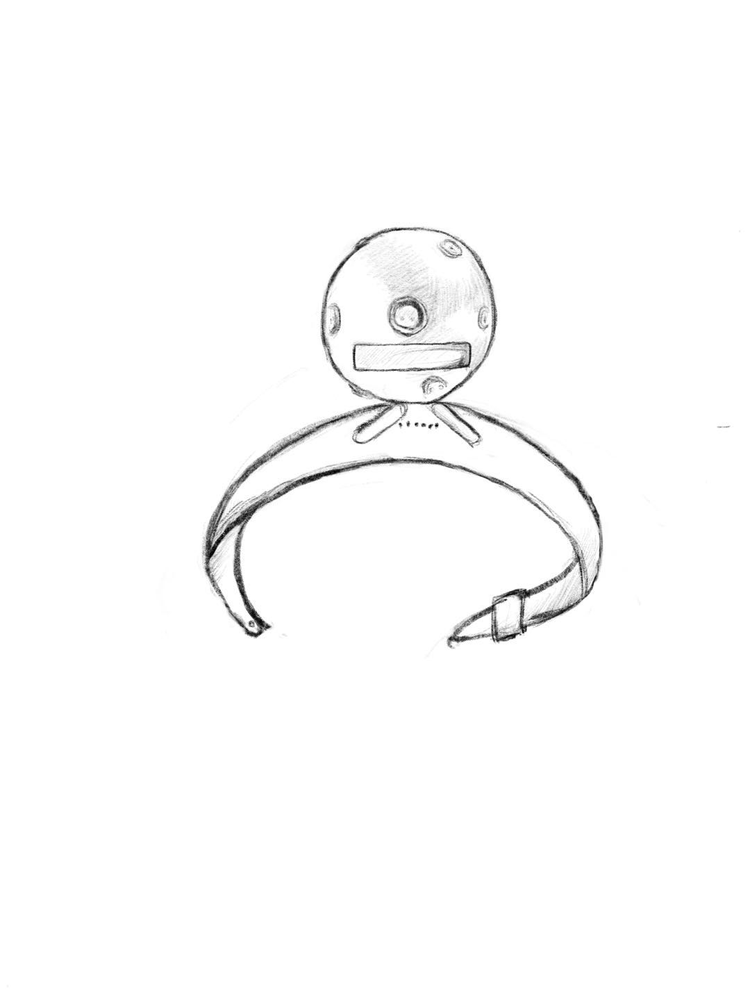

# panorama watch
## “Understand the world and hold it in hands”

## Combining with panoramic camera technology and AR recognition

## a watch can bring you conveniences

# How to use Panorama watch
-download the app from *www.panaromawatch.com* on your watch
now three apps available: *findrestaurants*, *safewalkers*, *bestclimbers*

-take your watch and go to the street

-choose the mode(app)

-raise your hands and the watch will automatically take photos of your surrondings

-*findrestaurants* mode: the watch can recognize your position according to the panoramic photos
the screen then will show you nearby restaurants

-*safewalkers* mode: the watch can spot stalkers and robbers and remind you by shaking
the screen will show you nearby safe public places
you can receive information by sound box as well

-*bestclimbers* mode: the watch can identify your current position(connect to Google map)
the screen will show you best climbing route
and the watch can save images you like

-bluetooth: connect to your headphone

-advantages: capture your nearby scenes, recognize by using AR technology. The only information you need to provide is the panoramic photo, and the watch can give you exact and efficient feedback.
