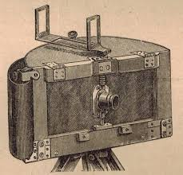

# Panoramic Cameras 1843-1994

- ### 1843

 *Joseph Puchberger* of Retz, Austria, patented a hand crank driven swing lens
panoramic camera that used daguerrotype plates 19 to 24 inches long. Camera had an
8-inch focal length lens and covered a 150 degree arc.
- ### 1844
*Friedrich von Martens*, a german living in Paris, made the Megaskop camera,
featured a swing lens, operated by a handle and gears.. The first model used 4.7" x 15"
curved daguerrotype plates that had a 150 degree arc. A later model used
wet plate curved glass emulsions.
1857 - M. Garella of England made and patented a rotating photographic instrument
with up to 360 degree field of view, using the same principle as the Cirkut camera of 1904.

- ### 1857
 Ross of New York developed a Scioptric camera that took a 120 degree panorama
on three curved glass plates and was similar to the Megaskop.

- ### 1858
*Charles Chevallier*, of Paris, built a camera with a curved plate which revolved -
while the camera itself revolved in the opposite direction on an axis under the plate. The
camera had radial shutters, limiting the surface of the plate exposed at any
one time. Also in 1858 - *Thomas Sutton* came up with a panoramic camera which was
made by Ross Optical Co. of London. Pictures made a 120 degree arc at f-12 on curved
plates using a spherical lens filled with water to achieve the wide field effect.
- ### 1862
Johnson and Harrison Pantascopic camera produced a 110 degree view on
7 1/2" x 12" flat collodion plates using clockwork controlled by a vane governor which
was made in England. A photographer named Braun took 400 Alpine
panoramas using this camera and was praised for the "fine technical qualities,
cloud and aerial effects."

- ### 1865
Prout's panoramic camera developed in England.

- ### 1865
The Rowland panoramic camera also developed in England.

- ### 1867
*Silvy*, an Englishman, produced a circular-backed panoramic camera within which
he gradually unwound the sensitive sheet from a spool through the camera.

- ### 1875
 Col. Mangin's Perigraphs Instantane, made in Paris by Bardon, made a 360 degree
sweep with a special lens that gave a long strip photograph.

- ### 1882
Paul Lieselang Rotations-Apparat camera made in Germany. Similar in principle to
the 1862 J&H Pantascopic except that a handle and gearing apparatus was used to turn
the camera instead of clockwork.

- ### 1884
 *P. Moessard* of France was granted a patent for a rotating lens panoramic camera
called the Cylindrographe which covered a 170 degree field of view and was rotated by
hand to expose the film.

- ### 1887
 *J.R. Cannon*, a Canadian, patented a simple cycloramic camera fitted with a lens
of fixed focus. The film traveled between two rollers while the camera was turned by hand
on the optical center of the lens and could accomplish a 360 degree picture.

- ### 1889
*Rudolph Stirn*, of Berlin, made a 360 degree panoramic camera called "The
Wonder Panoramic Camera." It was designed by an American, J.R. Connon, and patented
in America by Carl Stirn of New York. The box shaped camera was made of wood and
used 3 1/4" film.

- ### 1890
*Jules Dames*, of Paris, built the cyclographe camera which could make a 360 degree
pictue (8.5cm x 80cm) on a key wind clockwork driven mechanism. Later, Dames also
made a panoramic stereoscopic model that had paired lenses and two spools of film to pass
two slits.

- ### 1891
 The Star Panoramic camera made in New York was very similar to the Moessart
instrument, having a crescent shaped back carrying a curved film, a bellows body and a
lens moving on a pivot over the optical center.

- ### 1894
 Marcellus Cycloramic panoramic camera made by *Percy S. Marcellus* of
Philadelphia, which was a 360 degree slit roll film camera. It was available in eight
camera sizes from 4" wide to 18" wide.

- ### 1895
 Scovill Panoramic Camera made by *Scovill & Adams Co.*, of New York City,
was equipped with a swinging lens. Up to 18" x 48" picture was available. The 10" x 30"
model cost $250 while the 16" x 43" model cost $300. It was patented by
Mathias Flammang in 1894.

- ### 1898
The No. 4 Al-Vista panoramic camera was made by *Multiscope & Film Co,*
Burlington, Wisconsin, and was invented by Peter N. Angsten and Charles H. Gesbeck
in 1896. It used a 4" film with 160 degree field of view and 12" long exposure.

- ### 1899
No. 4 Kodak Panoram Camera made by *Eastman Kodak Co.*, *Rochester, N.Y.*,
used 103 film and had a 142 degree field of view with a 3 1/2" x 12" photograph.

- ### 1900
No. 1 Kodak Panoram introduced by *Eastman Kodak* and patented by *Frank A.
Brownwell* in 1901. Used 105 film and gave a 112 degree 2 1/4" x 7" picture.

- ### 1900
Caleb Panoramique Camera was a hand held swing lens box camera made in
France. It made a 180 degree 3 1/4" by 10 5/8" picture.

- ### 1901
 Midg Panoramic Camera made by *W. Butcher & Sons of London* was a falling-plate
magazine box type camera using an achromatic lens and a simple shutter that made
61mm x 165mm pictures.

- ### 1902
 Aptus Panoramic Camera made by *Sharp & Hitchmough* of England was a falling
plate magazine box type version that produced 61mm x 165mm photographs with a
simple shutter.

- ### 1902
*George Lawrence* of Chicago, built swing lens panoramic cameras in seven
sizes varying from 10" x 24" to 26" x 96". In 1906 he made the world famous Panorams
of the San Francisco earthquake.

- ### 1902
 *Hinton & Co. Dual* Panoramic Camera had a curved back that gave a 4" x 12"
picture utilizing a swiveling lens and could also make flat 4" x 6" photographs.

- ### 1904
*Frederick W. Mueller* of Baltimore made and patented a 360 degree Cyclorama
camera using the revolving lens principle. Before WW1 one of his cameras was used
for the first aerial photos taken using a U.S. navy plane. The germans offered Mueller
$25,000 for his aerial panoramic camera, but no deal was made due to the outbreak of war.

- ### 1904
The Turret Panoramic Camera from Brooklyn, was introduced which was a swing
lens box camera that produced 4" x 10" pictures.

- ### 1904
Cirkut No. 10 and No. 16 cameras were now manufactured by the *Rochester
Panoramic Camera Co.* They made up to 360 degree views on a fan governed clockwork.
The 10" wide roll film Cirkut camera was the most widely used panoramic
camera by the professional photographer.

- ### 1906
Century Camera Co. of Rochester, introduced the Cirkut Panoramic attachment
to fit on customers own 5" x 7" camera. It could make 360 degree pictures on 6 1/2" film.

- ### 1906
 The French *Drauss Deubresse* Panoramic Camera was cylindrical in shape. Film
was curved on the cylinder while the lens and prism unit was rotated by clockwork to
produce a panoramic image.

- ### 1907
The No. 6 and No. 8 Cirkut outfit cameras were introduced by Century Camera Co,
of Rochester, N.Y. The outfit could be used as a standard view camera or with the Cirkut
back to take panoramic photographs up to 360 degrees.

- ### 1907
 Minimum Palmos Stereo made by *Carl Zeiss Jena*, Jena Germany. The camera
front could be shifted to take 9cm x 18cm panoramic pictures on glass plates using a
focal plane shutter.

- ### 1908
 The Bell Panorama invented by *Isaac A. Bell of Crinnell*, Iowa, was a
stationary wide angle type panoramic camera. It made a standard size picture of
3 1/2" x 5 1/2" as well as a panoramic picture 3 1/2" x 11 1/2" on standard 122 roll film.

- ### 1911
*Conley Camera Co.*, of Rochester, Minnesota, introduced their Model A
Conlley Panoramic Camera. It made a 140 degree 3 1/2" x 12" picture on standard 103
roll film. It was marketed by Sears Roebuck & Co. in their catalogs and also sold
by Northern Photo Supply Co of Minneapolis as the Queen City Panoramic Camera.

- ### 1911
ICA Polyscop Stereo Camera made by ICA, AG of Dresden, Germany,
where the front could be shifted to take 6cm x 13cm panoramic pictures on plates
using compound shutter.

- ### 1912
Doppel-Sport Panoramic Camera invented by *Dr. Julius Neubronner* of Kronberg,
Germany, that was carried by a pigeon. A delayed action shutter on the swing lens
camera was set before the pigeon was released and gave a 3cm x 8cm
exposure.

- ### 1915
The clockwork-slit No. 5 Cirkut camera was presented by the *Folmer & Shwing
division of the Eastman Kodak co. of Rochester*, N.Y. and patented by William F. Folmer
in 1918. The camera could make a 360 degree exposure on 5" roll film
and was the smallest most compact Charcot manufactured.

- ### 1926
The swing-lens 3A Kodak Panoram was announced by the *Eastman Kodak Co*,
of Rochester, N.Y. It made a 120 degree 3 1/4" x 10 3/8" picture on standard 122 roll film
and was patented by William A. Riddell in 1926.

- ### 1930
 *Oscar Barneck*, the famed German Leica designer, made a swing-lens prototype
35mm panoramic camera. It was a crude example and never got into production.

- ### 1931
The clockwork-slit No. 6 Charcot camera was entered into production by *Folmer-
Graflex of Rochester*. This camera was capable of making a 360 degree picture on 6" roll film.

- ### 1932
*W.B. Osborne* designed his Osborne Photo Recording Transit, a swing-lens
panoramic camera made by Lupoid-Vollpel of Portland, Oregon. It was used by the
USDA Forest Service and turned out 120 degree 6" x 14" photographs.

- ### 1943
U.S. Navy aircraft torpedo camera made by Solar Aircraft Co, Russell Vought
Div, San Diego, that used 120 film and made 2 1/4" x 7 1/4" photographs. It was a stationary
wide angle camera that had a torpedo plane alignment that showed the
torpedo launch and impact results.

- ### 1944
Fairchild Camera Corp, USA, made a U.S. Air Force Panoramic aerial "strike camera"
that made a 180 degree 2 1/4" x 10" picture on 70mm film with a Carl Zeiss 3" lens and
rotating prism. It was supplied with a 250' film magazine and used the
aircraft power supply.

- ### 1948
The swing lens revolving slit Panon Wide Angle Camera made a 140 degree
2" x 4 1/2"  picture on standard 120 roll film which was manufacdtured by the Panon
Camera Co. Ltd. of Japan.

- ### 1953
*Milbo Photographic Ltd.* of Milbough, England, made a modern version of the Charcot
camera. It was all metal construction and powered by batteries.

- ### 1956
*Burke & James, Inc.* of Chicago, came out with their wide angle stationary Panoram 120
camera. It made 90 degrees 2 1/4" x 7" pictues on standard 120 roll film and it had detachable
ground glass back and film magazines.

- ### 1958  
The swing-lens revolving slit Russian FT-2 35mm panoramic camera made a 120 degree
24mm x 110mm picture and was manufactured by the Krosnogorsk Mechanical factory in
Krasnogorsk, USSR.

- ### 1958
Panorax Zi-A made by *Nippon Tokushu Koki Co.* of Kawasaki, Japan, used 35mm
film and a traveling slit shutter which could make 360 degree pictures.

- ### 1958
The swing-lens revolving slit Widelux 35mm model FV was introduced by the
*Panon Camera Co, ltd.*, of Japan. It made 140 degree 25mm x 60mm negatives.

- ### 1960
Veriwide 100 wide angle stationary camera made by *Ploubel & Co.*, of Frankfurt,
Germany, produced 100 degree 6cm x 9cm pictues on 120 roll film.

- ### 1961
Viscawide 16, a small rotating lens camera manufactured by *Taiyokoki Co. Ltd*,
Japan. It used 16mm film and created 120 degree 10mm x 46mm negatives.

- ### 1963
Panophic with a traveling-slit shutter produced 140 degree 5cm x 12cm on 120 roll
film. It was built by the Panon Camera Co of Japan.

- ### 1968
Horizont, a 35mm pivoting lens camera made by Krasnogorski Mechanical Factory,
Kransogorski, USSR, produced 120 degree photographs.

- ### 1969
Sea Gull RL-360 Panoramic camera manufactured by the Shanhel Camera Factory
No. 4, china, which used 8" black and white roll film. The electrically driven camera could
make 360 degree pictures. The chinese produced this camera for their
photographers to replace their aging No. 8 Charcot outfits.

- ### 1970
Zeiss-Ikon Contarex Hologon Ultrawide 110 degree angle of view camera, with 35mm
full frame picture, fixed focus, focal plane1-5/500 sec. shutter and Carl Zeiss Hologon 15mm
f8 fixed aperture lens.

- ### 1973
Cyclo-Pan 70 360 degree Panorama slit camera made by Third Media Enterprises
in California. It is battery powered and uses 70mm film.

- ### 1976
Linhof Technorama 612 PC - a fixed camera from germany takes 6cm x 12cm
pictures on 120 roll film.

- ### 1976  
I-Pan, a stationary camera, made a 81 degree picture on 35mm film.

- ### 1977
Art Panorama 240 with a Seiko shutter, manufactured by *Tomimaya Seisakusho Co.*
of Japan, on 120 film made a 60mm x 240mm image.

- ### 1978
Brooks-Veriwide, a fixed camera, made by *Burleight Brooks, Inc.* of Englewood, N.J.,
produces a 6cm x 12cm picture on 120 roll film.

- ### 1979
Hulcherama, model 120 can make 360 degree photographs on 120 or 220 roll film.
The slit camera is battery powered and made by Charles A. Hulcher Co., of Hampton, VA.

- ### 1981
Globuscope 360 degree 35mm slit camera with a fluid drive spring motor mechanism
made by Globuscope, Inc, New
York.

- ### 1982
Fuji G617, a wide angle stationary camera manufactured by Fuji Photo Film Co, of
Japan, takes a 6cm x 17cm picture on 120 or 220 roll film.

- ### 1983
Alpa Roto 70, a 360 degree slit camera battery powered by electronically governed
motor. It is produced by Alspa-Pignons S.A. of Switzerland and uses 70mm film or 220 roll film.

- ### 1985
Panoscope model 35/35 and model 65/70 panoramic cameras made by Seitz
Phototechnic, AG, Switzerland, are 360 degree battery powered slit cameras.

- ### 1986
Electropan provided by Photo Connection of Laguna Hills, Ca., which is a 145 degree
rotating battery powered 120 roll film swing lens camera that takes a 2" x 4 3/4" photograph.

- ### 1987
Widelux 1500 made by Panon Camera Shoko Co, of Japan. It is a 150 degree 120
roll film swing lens camera that takes a 50mm by 122mm image.

- ### 1988
Roundshot made by Seitz Phototechnic AG, Switzerland, where it was available in
four sizes of film - 110, 35mm, 70mm-220 and 5". The 360 degree slit camera is
battery powered.

- ### 1990
Cyclops Wide-eye, a 110 degree, 120 roll film, mechanical swing lens camera
manufactured by Double W Inc. of Gulliver, MI.

- ### 1990
 Corrales 360 degree slit-scan 35mm camera produced by Corrales Camera,
Whittier, Ca. It is powered by a mechanical spring handle for rotation. Also sold as
Spinshot 35mm Panoramic camera 1991 - panoramic 120 uses 120 fillm
and makes 2 1/4" x 5l" 120 degree images. Camera is lensless using a pinhole
for film exposure and is made by Mottweiler Photographic of Santa Fe, N.M.

- ### 1992
V-Pan Panoramic Camera which is a 6cm by 17cm view camera using 120 film.
Built by V-Pan Panoramic Cameras,
St. Louis, MO.

- ### 1992
 Horizon 202 Panoramic uses 35mm film and takes a 120 degree 24mm x 58mm image.
This Russian made swing lens camera is represented by Bogen Photo, Ramsey, N.J.

- ### 1992
Noblex Pro makes a 146 degree 50mm by 120mm image on 120 roll film. The rotating
slit drum is battery powered
and the camera is manufactured by *Kamera Werke*, Noble, Dresden, Germany.

- ### 1992
Roundshot Super Camera made by Seitz of Switzerland and designed for
interchangeability with Hasselblad bayonet lenses. Makes 360 degree images with battery
power on changeable 70mm and 220 film magazines.

- ### 1993
 Fujo GX617 from Japan, a fixed 6cm by 17cm format camera with three
interchangeable lenses (90mm, 105mm and 180mm) using 120 or 220 roll film.

- ### 1994
Noblex Pro 06/150 HS is a high speed 146 degree rotating lens panorama camera
made by Kamera Werke, Noble, Dresden, Germany, that is battery powered and
uses 120 roll film.

